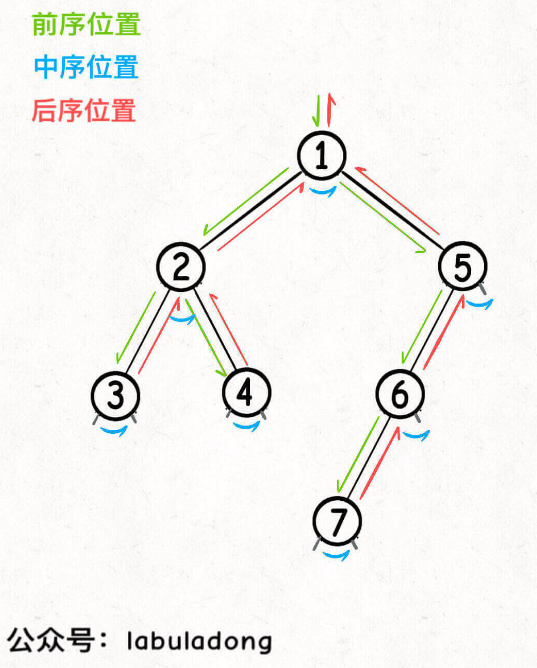

# 题型

## 链表

1. 头节点
2. 双指针
    1. 倒数第k个节点
    2. 环形链表
    3. 合并链表
    4. 分解链表
3. 递归

## 数组

1. 快慢指针
    1. 原地删除
    2. 滑动窗口: left 指针在后，right 指针在前，两个指针中间的部分就是「窗口」，算法通过扩大和缩小「窗口」来解决某些问题

## 二叉树

1. 二叉树遍历框架: `分清函数递归顺序和前中后遍历位置的关系`
   ```java
   public class Main {

       static class TreeNode {
           int val;
           TreeNode left;
           TreeNode right;
       }

       public void traverse(TreeNode root) {
           
           if (root == null) {
               return;
           }
           
           // 前序遍历位置
           traverse(root.left);
           // 中序遍历位置
           traverse(root.right);
           // 后序遍历位置
       }
   }
   ```
2. 二叉树解题的两种思维模式
    1. 遍历
        - 遍历函数 + 外部变量
        - 遍历函数签名一般是 `void traverse(...)` ，没有返回值，靠更新外部变量来计算结果
        - 对应回溯算法
    2. 分解问题: 将原问题分解为结构相同并且规模更小的子问题，由子问题的结果反推出原问题的结果
        - 函数定义 + 返回值
        - 定位递归函数，明确递归函数的语义，输入和输出
        - 递归函数名根据该函数具体功能而定，而且一般会有返回值，返回值是子问题的计算结果
        - 对应动态规划
3. 快速排序就是二叉树的前序遍历，归并排序就是二叉树的后序遍历
4. 前中后序遍历本质
    - 二叉树的结构是二叉链表，每个节点都有左子树和右子树
    - 前中后序是遍历二叉树过程中处理每一个节点的三个特殊时间点
    - 前序位置的代码在刚刚进入一个二叉树节点的时候执行
    - 中序位置的代码在一个二叉树节点左子树都遍历完，即将开始遍历右子树的时候执行
    - 后序位置的代码在将要离开一个二叉树节点的时候执行
    - 把代码写在不同位置代码执行的时机也不同
5. 二叉树的题目的通用思考过程是：
    1. 是否可以通过遍历一遍二叉树得到答案？如果可以，用一个 traverse 函数配合外部变量来实现
    2. 是否可以定义一个递归函数，通过子问题（子树）的答案推导出原问题的答案？如果可以，写出这个递归函数的定义，并充分利用这个函数的返回值
    3. 无论使用哪一种思维模式，你都要明白**二叉树的每一个节点需要做什么，需要在什么时候（前中后序）做**
    4. 如果需要涉及到子树信息，建议使用后序遍历
6. 后序位置的特殊之处:
    1. 前序位置的代码执行是自顶向下的，而后序位置的代码执行是自底向上的
    2. 前序位置的代码只能从函数参数中获取父节点传递来的数据，而后序位置的代码不仅可以获取参数数据，*
       *还可以获取到子树通过函数返回值传递回来的信息**
    3. 
7. 以树的视角看动归/回溯/DFS算法的区别和联系，动归/DFS/回溯算法都可以看做二叉树问题的扩展，只是它们的关注点不同：
    1. 动态规划算法属于分解问题的思路，它的关注点在整棵「子树」。
    2. 回溯算法属于遍历的思路，它的关注点在节点间的「树枝」。
    3. DFS 算法属于遍历的思路，它的关注点在单个「节点」。
8. 遍历的思维模式可以帮你寻找从根节点开始的符合条件的「树枝」，但在不限制起点必须是根节点的条件下，让你寻找符合条件的「树枝」，就需要用到分解问题的思维模式了
9. 判断当前节点是叶子节点代码片段:
   ```java
   if (root.left == null && root.right == null) {
        // TODO
   }

```

# 重点题目

1. lc.912 归并排序